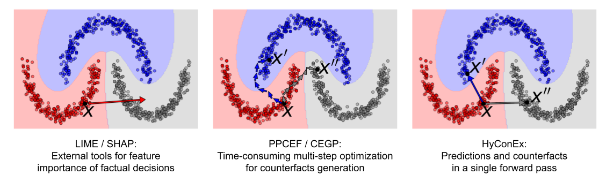

# HyConEx — 心脏病数据集适配版

本仓库是 **[HyConEx](https://arxiv.org/abs/2503.12525)** （深度超网络反事实解释分类器）在 **心脏病（Heart Disease）数据集** 上的适配实现。

原版 HyConEx 只内置了 MOONS / ADULT / HELOC / LAW 等数据集，本仓库在保留原模型与训练流程不变的前提下，新增了一条完整的心脏病数据通路：从 OpenML 拉取原始数据 → 清洗与二值化 → 划分标准化 → 封装为可训练的 Dataset → 训练与评估。

> 一句话概括：**算法是别人的，我做的事是把 HyConEx 跑通在心脏病数据上。**

---

## 1. 上游来源

| 项目 | 说明 |
|---|---|
| 论文 | [HyConEx (arXiv:2503.12525)](https://arxiv.org/abs/2503.12525) |
| 原版代码 | [ArlindKadra/IMN](https://github.com/ArlindKadra/IMN)、[ofurman/counterfactuals](https://github.com/ofurman/counterfactuals) |

HyConEx 的核心思路：用一个**超网络（HyperNet）** 为每个样本动态生成分类器权重，因此模型在给出类别预测的同时，还能直接产出该样本的**反事实解释**（把样本推向另一类所需的最小特征改动），做到「预测 + 解释」一体化。

<p align="center">

</p>

---

## 2. 本仓库相对原版做了哪些改动

| 文件 | 改动内容 |
|---|---|
| `prepare_heart_simple.py` | **新增**。心脏病数据集预处理脚本：OpenML 加载、类别二值化、独热编码、分层划分、Z-Score 标准化，输出 `data/heart_disease_processed.npz` |
| `hyconex/configs.py` | **新增 `HeartDataset` 类**（约 L12–L218），并从 `npz` 加载数据、构造 PyTorch `TensorDataset`、实现 `train_dataloader` / `eval_dataloader` / `get_cv_splits` / `get_split_data` 等接口；同时把 `HEART` 注册进 `DatasetType` 枚举 |
| `train_model.py` | **新增兼容补丁**：把 `omegaconf.DictConfig`、`ContainerMetadata` 加入 `torch.serialization.add_safe_globals`，解决新版 PyTorch 加载 checkpoint 被安全策略拦截的问题 |
| `tesy.py` | **新增**。`HeartDataset` 的冒烟测试脚本，逐项校验实例化、各 DataLoader 调用方式与辅助方法 |
| `counterfactuals_evaluation.py` | 沿用原版，未改动（对心脏病数据的适配性见第 8 节） |
| `README.md` | 重写为本文件 |

除此之外的 `hyconex/`（模型、超网络、初始化）与 `counterfactuals/`（CF 方法与指标）代码**均为上游实现，未做实质修改**。

---

## 3. 环境安装

原版使用 conda 环境，Python 3.11：

```shell
conda create -n hyconex python=3.11
conda activate hyconex
pip install -r requirements.txt
pip install torch==2.5.1+cu121 --index-url https://download.pytorch.org/whl/cu121
```

首次运行训练脚本会自动初始化 `wandb`（原版逻辑），离线环境可先执行：

```shell
export WANDB_MODE=offline        # Windows PowerShell: $env:WANDB_MODE="offline"
```

---

## 4. 数据准备

```shell
python prepare_heart_simple.py
```

脚本会通过 `sklearn.datasets.fetch_openml` 拉取 `heart-disease`（version 1），并完成以下处理：

1. 目标列自动识别（在 `target` / `class` / `disease` / `num` / `result` 中查找，兜底取最后一列）；
2. **二值化**：`y = (y_raw > 0)`，即 0 = 健康，1 = 患病；
3. 分类特征自动独热编码（`drop_first=True`），本数据集全为数值特征，故 13 维保持不变；
4. **分层划分 60% / 20% / 20%**（`random_state=42`, `stratify=y`）；
5. `StandardScaler` 标准化（仅用训练集 `fit`，再 transform 验证/测试集，避免数据泄漏）；
6. 保存为 `data/heart_disease_processed.npz`。

处理后数据规格：

| 划分 | 样本数 | 特征数 |
|---|---|---|
| 训练集 | 181 | 13 |
| 验证集 | 61 | 13 |
| 测试集 | 61 | 13 |
| **合计** | **303** | **13** |

数据校验（可选）：

```shell
python tesy.py
```

全部通过时会打印 `✅ 所有验证通过！可以开始训练了！`。

> `data/` 目录已加入 `.gitignore`，不随仓库分发；请本地执行预处理脚本自行生成。

---

## 5. 快速开始

HyConEx 采用**两阶段训练**：先预训练基模型（让分类器收敛），再进入反事实阶段（逐步开启距离/流/分类损失）。

**阶段一 · 预训练**

```shell
python train_model.py dataset=HEART pretrain=True \
    class_lambda=0.9 dist_lambda=0.05 flow_lambda=0.05 \
    pretraining_epochs=500
```

**阶段二 · 反事实训练**（`model_load_path` 传**目录**，脚本会从中读取 `base.pt` / `checkpoint.pt`）

```shell
python train_model.py dataset=HEART pretrain=False \
    model_load_path="results/hyconex/HEART/0/0.9/0.05/0.05/400/CE" \
    class_lambda=0.9 dist_lambda=0.05 flow_lambda=0.05 \
    nr_epochs=1500
```

**反事实评估**（注意此处 `model_load_path` 传的是 **`checkpoint.pt` 文件完整路径**）

```shell
python counterfactuals_evaluation.py dataset=HEART device=cpu \
    model_load_path="results/hyconex/HEART/0/0.9/0.05/0.05/400/CE/checkpoint.pt"
```

加 `full_evaluation=True` 会额外跑 CEGP / CBCE / WACH / CEM / PPCEF 五个基线方法（见第 8 节限制说明）。

查看全部可配置项：

```shell
python train_model.py --help
```

---

## 6. 训练机制与输出

关键超参数（定义于 `hyconex/configs.py` 的 `HyConExConfig`）：

| 参数 | 本实验取值 | 含义 |
|---|---|---|
| `nr_blocks` / `hidden_size` | 4 / 256 | 超网络层数与隐藏维度 |
| `dropout_rate` | 0.25 | Dropout |
| `batch_size` | 256 | 批大小 |
| `learning_rate` | 5e-4 | 学习率 |
| `class_lambda` | 0.9 | 反事实分类损失权重 |
| `dist_lambda` | 0.05 | 反事实距离损失权重 |
| `flow_lambda` | 0.05 | 反事实流（归一化流）损失权重 |
| `class_start_epoch` | 500 | 分类损失开始介入的 epoch |
| `dist_start_epoch` / `flow_start_epoch` | 400 / 400 | 距离 / 流损失开始介入的 epoch |
| `early_stopping` | True | 是否启用早停 |

输出目录由配置自动拼装（见 `hyconex/initialization.py`）：

```
results/hyconex/HEART/<seed>/<class_lambda>/<dist_lambda>/<flow_lambda>/<flow_start_epoch>/<loss_type>/
```

本实验对应 `results/hyconex/HEART/0/0.9/0.05/0.05/400/CE/`，其中：

| 文件 | 说明 |
|---|---|
| `base.pt` | 预训练阶段保存的基模型 |
| `checkpoint.pt` | 完整检查点（模型 + flow + `log_prob_threshold`），供评估脚本加载 |
| `best_model.pt` | 验证指标最优的模型 |
| `best_model_1500.pt` | 按 epoch 编号保存的最优模型快照 |

训练指标同时写入 `results3.csv`（含 coverage / validity / proximity / plausibility / AUROC / ACC 等列）。

---

## 7. 实验结果

在心脏病数据集（303 样本 / 13 特征 / 二分类）上的训练轨迹（摘自 `results3.csv`）：

| epoch | validity ↑ | proximity (euclidean) ↓ | prob_plausibility ↑ | test AUROC ↑ | test ACC ↑ |
|---|---|---|---|---|---|
| 51 | 0.0000 | — | 0.0000 | 0.8355 | 0.7541 |
| 522 | 0.0227 | 0.3810 | 0.6713 | 0.7803 | 0.7377 |
| 573 | 0.6033 | 1.1649 | 0.6313 | **0.8690** | 0.7705 |
| 709 | 0.9839 | 1.7606 | 0.6699 | 0.8550 | **0.8033** |
| 825 | 0.9839 | 1.7873 | 0.6704 | 0.8409 | **0.8033** |
| 916 | **1.0000** | 1.7319 | 0.6762 | 0.8171 | 0.7377 |

要点：

- **反事实有效性（validity）随训练稳定爬升**，从 epoch 522 的 0.02 提升到 epoch 916 的 **1.0000**，说明分类损失在 `class_start_epoch=500` 介入后逐步生效；
- **最佳分类性能**出现在反事实损失完全介入之前：epoch 573 取得最高 test AUROC **0.8690**，epoch 709–825 取得最高 test 准确率 **0.8033**；
- 后期 validity 升至 1.0 时分类指标略有回落，反映出**有效性 与 分类精度之间的权衡**，也说明在小样本（303 条）场景下超参仍偏敏感；
- `proximity` 随 validity 上升而增大（0.38 → 1.73），符合预期：让样本成功翻类需要更大的特征改动。

> 以上数值来自 `results3.csv` 中 `dataset == HEART` 的记录，为超参 `class_lambda=0.9 / dist_lambda=0.05 / flow_lambda=0.05` 下的单次运行结果，未做多次种子平均。

---

## 8. 已知问题 / 待办

1. **`full_evaluation=True` 在 HEART 上会报错。**
   `HeartDataset` 是独立类，未继承 `counterfactuals.datasets.base.AbstractDataset`，因而缺少 `categorical_features_lists` 属性；
   而 `counterfactuals_evaluation.py` 在构建 CBCE 基线时会无条件读取该属性，导致 `AttributeError`。
   **修复方向**：让 `HeartDataset` 继承 `AbstractDataset`，或补一个返回 `[]` 的 `categorical_features_lists` 属性。
2. **`prepare_heart_simple.py` 末尾打印的操作指引已过期**，与当前代码不一致：其提示的 `datasets.py` 实际为 `hyconex/configs.py`；提示的参数名 `num_epochs` 实际为 `nr_epochs`；`model_load_path` 应指向目录而非某个 checkpoint 文件。**请以本 README 第 5 节的命令为准。**
3. **未做多次种子重复实验**，当前仅 `seed=0` 单次结果，结论的统计稳健性有限。
4. **对比基线尚未跑通**，因此目前无法给出 HyConEx 与 CEGP / CBCE / WACH / CEM / PPCEF 在心脏病数据集上的横向对比表。
5. 模型权重（`*.pt` / `*.pth`）与 `results/`、`wandb/` 均未纳入版本控制，如需复现请本地训练。

---

## 9. 目录结构

```
HyConEx-main/
├── hyconex/                      # 核心模型（上游代码）
│   ├── configs.py                # ★ HeartDataset + DatasetType.HEART + 全部超参
│   ├── hypernetwork.py           # 超网络实现
│   ├── model.py                  # HyConEx 主模型与训练循环
│   ├── model_utils.py            # 指标、反事实评估、one-hot 等工具
│   └── initialization.py         # 配置 / 数据 / 模型初始化入口
├── counterfactuals/              # 反事实方法与数据集（上游代码）
│   ├── cf_methods/               # CEGP / CBCE / WACH / CEM / PPCEF / SACE
│   ├── datasets/                 # 各数据集基类与实现
│   ├── generative_models/        # MAF 归一化流
│   ├── metrics/                  # 反事实评价指标
│   └── losses/                   # 判别损失
├── prepare_heart_simple.py       # ★ 心脏病数据预处理
├── tesy.py                       # ★ HeartDataset 冒烟测试
├── train_model.py                # 训练入口（含 PyTorch 反序列化补丁）
├── counterfactuals_evaluation.py # 反事实评估入口
├── results3.csv                  # 训练指标记录
├── data/                         # 数据集（已 gitignore，需自行生成）
├── imgs/Teaser.png
└── legal/IMN_LICENSE             # 上游 IMN 项目许可证
```

★ = 本仓库相对上游新增或修改的文件。

---

## 10. 引用与许可

若使用本仓库代码，请一并引用原论文与上游项目：

- HyConEx: <https://arxiv.org/abs/2503.12525>
- IMN: <https://github.com/ArlindKadra/IMN>
- Counterfactuals: <https://github.com/ofurman/counterfactuals>

上游 IMN 项目的许可证见 [`legal/IMN_LICENSE`](legal/IMN_LICENSE)，请遵循其条款使用。
